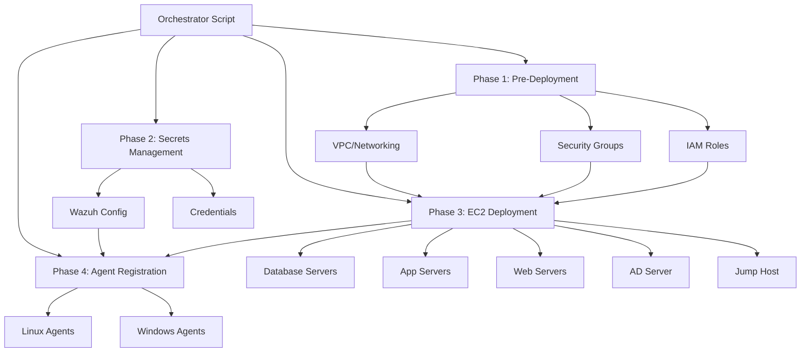
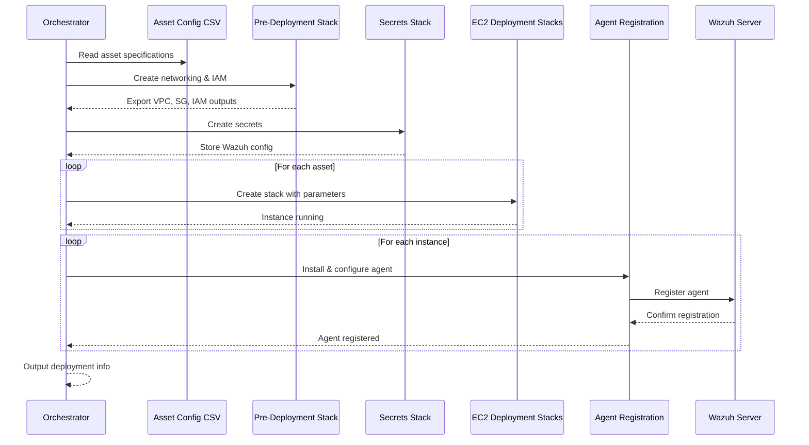

# Design Document: Simulated Bank Infrastructure

## Overview

This design document specifies the architecture and implementation approach for an automated deployment system that provisions a simulated bank infrastructure on AWS. The system deploys six distinct bank assets (database servers, application servers, web servers, Active Directory, and jump hosts) using CloudFormation Infrastructure-as-Code templates and automatically registers them with a Wazuh security monitoring server.

The design follows a modular, reusable template approach to minimize code duplication while supporting diverse operating systems (RHEL 8, Ubuntu 22.04, Windows Server 2022, Windows 11) and configurations. The system is driven by a CSV configuration file that defines asset specifications, enabling flexible infrastructure modifications without code changes.

### Key Design Goals

1. **Reusability**: Create parameterized CloudFormation templates that can be reused across multiple asset types
2. **Automation**: Single-command deployment of complete infrastructure with automatic Wazuh agent registration
3. **Configurability**: CSV-driven asset specifications for easy modification
4. **Dependency Management**: Proper sequencing of stack creation with prerequisite validation
5. **Observability**: Comprehensive logging and status reporting throughout deployment
6. **Maintainability**: Clear separation of concerns between networking, secrets, compute, and agent registration

## Architecture

### High-Level Architecture

The system follows a four-phase deployment architecture based on the proven pattern from the Wazuh reference implementation:



### Deployment Phases

**Phase 1: Pre-Deployment Stack**
- Creates shared networking infrastructure (VPC, subnets, internet gateway, route tables)
- Defines security groups for each asset type with appropriate ingress/egress rules
- Creates IAM roles and instance profiles for EC2 instances
- Exports outputs for use by subsequent stacks

**Phase 2: Secrets Stack**
- Stores Wazuh server configuration in AWS Secrets Manager
- Stores any credentials needed for agent registration
- Provides secure access to sensitive configuration

**Phase 3: EC2 Deployment Stacks**
- Reads asset specifications from CSV file
- Creates individual CloudFormation stacks for each asset using reusable templates
- Installs required software packages via user data scripts
- Configures instances based on asset type (database, application, web, AD, jump host)

**Phase 4: Agent Registration**
- Waits for EC2 instances to reach running state
- Installs Wazuh agents on each instance (OS-specific installation)
- Configures agents to connect to Wazuh server
- Registers agents with proper hostnames and groups
- Implements retry logic for failed registrations

### Component Interaction Flow



## Components and Interfaces

### 1. Orchestrator Script

**Purpose**: Main entry point that coordinates the entire deployment process

**Responsibilities**:
- Parse CSV asset configuration file
- Validate configuration and prerequisites
- Create CloudFormation stacks in correct dependency order
- Wait for stack creation completion
- Trigger agent registration for deployed instances
- Provide status logging and error handling
- Generate deployment summary output

**Interface**:
```bash
./deploy-bank-infrastructure.sh [OPTIONS]

Options:
  --config-file PATH        Path to CSV asset configuration (default: cloudFormationScripts-Bank-simulation/ORBIT_simulated_bank.csv)
  --wazuh-server IP         Wazuh server IP address (required)
  --wazuh-port PORT         Wazuh server port (default: 1514)
  --wazuh-group GROUP       Wazuh agent group name (optional)
  --region REGION           AWS region (default: from AWS CLI config)
  --dry-run                 Validate configuration without deploying
  --help                    Display usage information
```

**Outputs**:
- Console logging with timestamps and status
- `deployment-info.txt` file with connection details
- Exit code 0 on success, non-zero on failure

### 2. Pre-Deployment CloudFormation Template

**Purpose**: Create shared networking and IAM infrastructure

**Template**: `cloudFormationScripts-Bank-simulation/templates/pre-deployment.yaml`

**Parameters**:
- `ProjectName`: Project identifier for resource naming (default: "ORBIT-Bank")
- `Environment`: Environment tag (default: "simulation")
- `AdminIpCidr`: CIDR block for administrative access (default: "0.0.0.0/0")
- `WazuhServerIp`: Wazuh server IP for security group rules

**Resources Created**:
- VPC with CIDR 10.0.0.0/16
- Public subnet with CIDR 10.0.1.0/24
- Internet gateway and route table
- Security groups for each asset type:
  - Database security group (port 5432 from app servers)
  - Application security group (port 8080 from web servers)
  - Web security group (ports 80, 443 from internet)
  - Active Directory security group (ports 389, 636, 88, 445, 3389)
  - Jump host security group (ports 22, 3389 from admin IPs)
  - Wazuh agent security group (ports 1514, 1515 outbound to Wazuh server)
- IAM role with policies for:
  - AWS Systems Manager (SSM) access
  - Secrets Manager read access
  - CloudWatch Logs write access
- IAM instance profile

**Outputs** (exported for cross-stack references):
- `VpcId`: VPC identifier
- `SubnetId`: Public subnet identifier
- `DatabaseSecurityGroupId`: Security group for database servers
- `ApplicationSecurityGroupId`: Security group for application servers
- `WebSecurityGroupId`: Security group for web servers
- `ActiveDirectorySecurityGroupId`: Security group for AD servers
- `JumpHostSecurityGroupId`: Security group for jump hosts
- `WazuhAgentSecurityGroupId`: Security group for Wazuh agents
- `InstanceProfileArn`: IAM instance profile ARN

### 3. Secrets CloudFormation Template

**Purpose**: Store sensitive configuration in AWS Secrets Manager

**Template**: `cloudFormationScripts-Bank-simulation/templates/secrets.yaml`

**Parameters**:
- `WazuhServerIp`: Wazuh server IP address
- `WazuhServerPort`: Wazuh server port
- `WazuhAgentGroup`: Optional agent group name

**Resources Created**:
- AWS Secrets Manager secret: `orbit/bank-infrastructure/wazuh-config`
  - Contains JSON with Wazuh server connection details

**Outputs**:
- `WazuhConfigSecretArn`: ARN of the Wazuh configuration secret

### 4. Reusable Linux Template

**Purpose**: Parameterized template for Linux-based assets (RHEL 8, Ubuntu 22.04)

**Template**: `cloudFormationScripts-Bank-simulation/templates/linux-instance.yaml`

**Parameters**:
- `Hostname`: Instance hostname
- `OperatingSystem`: OS type ("RHEL8" or "Ubuntu2204")
- `InstanceType`: EC2 instance type (t3.micro, t3.small, t3.medium)
- `SoftwarePackages`: Comma-separated list of packages to install
- `SecurityGroupId`: Security group ID from pre-deployment stack
- `SubnetId`: Subnet ID from pre-deployment stack
- `InstanceProfileArn`: IAM instance profile ARN
- `AssetId`: Asset identifier from CSV
- `BusinessDomain`: Business domain tag
- `SensitivityLevel`: Sensitivity level tag

**AMI Selection Logic**:
- RHEL8: Uses SSM parameter `/aws/service/rhel/8/latest/x86_64`
- Ubuntu2204: Uses SSM parameter `/aws/service/canonical/ubuntu/server/22.04/stable/current/amd64/hvm/ebs-gp2/ami-id`

**User Data Script**:
```bash
#!/bin/bash
set -e

# Set hostname
hostnamectl set-hostname ${Hostname}

# Update system
if [[ "${OperatingSystem}" == "RHEL8" ]]; then
    yum update -y
    yum install -y ${SoftwarePackages}
elif [[ "${OperatingSystem}" == "Ubuntu2204" ]]; then
    apt-get update
    apt-get upgrade -y
    apt-get install -y ${SoftwarePackages}
fi

# Signal completion
/opt/aws/bin/cfn-signal -e $? --stack ${AWS::StackName} --resource Instance --region ${AWS::Region}
```

**Resources Created**:
- EC2 instance with specified configuration
- Tags: Name, Asset_ID, Business_Domain, Sensitivity_Level, project, environment, component

**Outputs**:
- `InstanceId`: EC2 instance ID
- `PrivateIp`: Private IP address
- `PublicIp`: Public IP address (if assigned)

### 5. Reusable Windows Template

**Purpose**: Parameterized template for Windows-based assets (Server 2022, Windows 11)

**Template**: `cloudFormationScripts-Bank-simulation/templates/windows-instance.yaml`

**Parameters**: Same as Linux template, with OS values "WindowsServer2022" or "Windows11"

**AMI Selection Logic**:
- WindowsServer2022: Uses SSM parameter `/aws/service/ami-windows-latest/Windows_Server-2022-English-Full-Base`
- Windows11: Uses SSM parameter `/aws/service/ami-windows-latest/Windows-11-English-Full-Base`

**User Data Script** (PowerShell):
```powershell
<powershell>
# Set hostname
Rename-Computer -NewName "${Hostname}" -Force

# Install software packages
$packages = "${SoftwarePackages}" -split ","
foreach ($package in $packages) {
    # Use Chocolatey or native installers
    choco install $package -y
}

# Signal completion
cfn-signal.exe -e $lastexitcode --stack ${AWS::StackName} --resource Instance --region ${AWS::Region}
</powershell>
```

**Resources Created**: Same structure as Linux template

**Outputs**: Same as Linux template

### 6. Database Template

**Purpose**: Specialized template for PostgreSQL database servers

**Template**: `cloudFormationScripts-Bank-simulation/templates/database-instance.yaml`

**Parameters**: Extends Linux template parameters with:
- `DatabaseType`: Database type (default: "PostgreSQL")
- `DatabaseVersion`: PostgreSQL version (default: "15")
- `DatabasePort`: Database port (default: 5432)
- `DataVolumeSize`: EBS volume size in GB (default: 100)

**Additional Resources**:
- EBS volume for database storage (gp3, encrypted)
- Volume attachment to instance

**Enhanced User Data**:
```bash
#!/bin/bash
set -e

# Base Linux setup
hostnamectl set-hostname ${Hostname}
yum update -y

# Install PostgreSQL
yum install -y postgresql${DatabaseVersion}-server postgresql${DatabaseVersion}

# Initialize database
postgresql-setup --initdb

# Configure PostgreSQL
sed -i "s/#port = 5432/port = ${DatabasePort}/" /var/lib/pgsql/data/postgresql.conf
sed -i "s/#listen_addresses = 'localhost'/listen_addresses = '*'/" /var/lib/pgsql/data/postgresql.conf

# Mount EBS volume
mkfs -t ext4 /dev/xvdf
mkdir -p /var/lib/postgresql
mount /dev/xvdf /var/lib/postgresql
echo "/dev/xvdf /var/lib/postgresql ext4 defaults,nofail 0 2" >> /etc/fstab

# Start PostgreSQL
systemctl enable postgresql
systemctl start postgresql

# Signal completion
/opt/aws/bin/cfn-signal -e $? --stack ${AWS::StackName} --resource Instance --region ${AWS::Region}
```

**Outputs**: Same as Linux template plus `DataVolumeId`

### 7. Agent Registration Script

**Purpose**: Install and register Wazuh agents on deployed instances

**Script**: `scripts/register-agent.sh`

**Interface**:
```bash
./register-agent.sh --instance-id INSTANCE_ID --hostname HOSTNAME --os-type OS_TYPE

Options:
  --instance-id ID          EC2 instance ID
  --hostname NAME           Hostname for agent registration
  --os-type TYPE            Operating system type (linux or windows)
  --wazuh-server IP         Wazuh server IP address
  --wazuh-port PORT         Wazuh server port (default: 1514)
  --wazuh-group GROUP       Agent group name (optional)
  --max-retries N           Maximum registration retries (default: 3)
  --retry-delay SECONDS     Delay between retries (default: 10)
```

**Linux Agent Installation**:
```bash
# Wait for instance to be ready
aws ec2 wait instance-running --instance-ids $INSTANCE_ID

# Connect via SSM and install agent
aws ssm send-command \
    --instance-ids $INSTANCE_ID \
    --document-name "AWS-RunShellScript" \
    --parameters commands=[
        "curl -s https://packages.wazuh.com/key/GPG-KEY-WAZUH | apt-key add -",
        "echo 'deb https://packages.wazuh.com/4.x/apt/ stable main' | tee /etc/apt/sources.list.d/wazuh.list",
        "apt-get update",
        "WAZUH_MANAGER='$WAZUH_SERVER' apt-get install wazuh-agent -y",
        "systemctl daemon-reload",
        "systemctl enable wazuh-agent",
        "systemctl start wazuh-agent"
    ]

# Verify agent registration with retries
for i in $(seq 1 $MAX_RETRIES); do
    if check_agent_registered $HOSTNAME; then
        echo "Agent $HOSTNAME registered successfully"
        exit 0
    fi
    sleep $RETRY_DELAY
done

echo "ERROR: Agent registration failed after $MAX_RETRIES attempts"
exit 1
```

**Windows Agent Installation**:
```powershell
# Similar approach using AWS-RunPowerShellScript document
# Downloads and installs Wazuh Windows agent MSI
# Configures agent with Wazuh server IP
# Starts Wazuh service
```

### 8. Cleanup Script

**Purpose**: Remove all deployed infrastructure in correct dependency order

**Script**: `cleanup-bank-infrastructure.sh`

**Interface**:
```bash
./cleanup-bank-infrastructure.sh [OPTIONS]

Options:
  --confirm                 Skip confirmation prompt
  --keep-pre-deployment     Keep pre-deployment stack (VPC, IAM)
  --region REGION           AWS region (default: from AWS CLI config)
```

**Deletion Order**:
1. Delete all EC2 deployment stacks (parallel)
2. Wait for EC2 stack deletions to complete
3. Delete secrets stack
4. Wait for secrets stack deletion
5. Delete pre-deployment stack (unless --keep-pre-deployment specified)
6. Log summary of deleted resources

## Data Models

### Asset Configuration CSV Schema

**File**: `cloudFormationScripts-Bank-simulation/ORBIT_simulated_bank.csv`

**Columns**:
- `Asset_ID`: Unique identifier (e.g., "NS-01")
- `Hostname`: Instance hostname (e.g., "corebank-db-01")
- `AWS_Resource_Type`: Resource type (always "EC2" for this system)
- `Operating_System`: OS specification (e.g., "Linux (RHEL 8)", "Windows Server 2022")
- `Instance_Size`: EC2 instance type (e.g., "t3.small")
- `Business_Domain`: Business domain tag (e.g., "Core Banking")
- `Technical_Role`: Technical role description (e.g., "Database Server")
- `Sensitivity_Level`: Data sensitivity (e.g., "High", "Medium")
- `Data_Type`: Data classification (e.g., "PCI,PII")
- `Asset_Classification`: Asset importance (e.g., "Crown Jewel")
- `Wazuh_Agent_Required`: Whether Wazuh agent is needed (always "Yes")
- `OpenSource_Software_To_Install`: Comma-separated package list
- `Vulnerability_Demo_Capabilities`: Description of demo capabilities

**Parsing Logic**:
```python
import csv

def parse_asset_config(csv_path):
    assets = []
    with open(csv_path, 'r') as f:
        reader = csv.DictReader(f)
        for row in reader:
            asset = {
                'asset_id': row['Asset_ID'],
                'hostname': row['Hostname'],
                'os_type': normalize_os_type(row['Operating_System']),
                'instance_type': row['Instance_Size'],
                'software_packages': row['OpenSource_Software_To_Install'],
                'business_domain': row['Business_Domain'],
                'sensitivity_level': row['Sensitivity_Level'],
                'technical_role': row['Technical_Role']
            }
            assets.append(asset)
    return assets

def normalize_os_type(os_string):
    """Convert CSV OS string to template parameter value"""
    if 'RHEL 8' in os_string:
        return 'RHEL8'
    elif 'Ubuntu 22.04' in os_string:
        return 'Ubuntu2204'
    elif 'Windows Server 2022' in os_string:
        return 'WindowsServer2022'
    elif 'Windows 11' in os_string:
        return 'Windows11'
    else:
        raise ValueError(f"Unknown OS type: {os_string}")
```

### CloudFormation Stack Naming Convention

**Pattern**: `{project}-{component}-{asset-id}`

**Examples**:
- Pre-deployment: `orbit-bank-pre-deployment`
- Secrets: `orbit-bank-secrets`
- Database asset NS-01: `orbit-bank-ns-01`
- Application asset NS-02: `orbit-bank-ns-02`

### Wazuh Configuration Secret Structure

**Secret Name**: `orbit/bank-infrastructure/wazuh-config`

**JSON Structure**:
```json
{
  "server_ip": "10.0.1.100",
  "server_port": 1514,
  "agent_group": "bank-infrastructure",
  "protocol": "tcp"
}
```

### Deployment Information Output Structure

**File**: `deployment-info.txt`

**Format**:
```
========================================
ORBIT Bank Infrastructure Deployment
========================================
Deployment Time: 2024-01-15 14:30:00 UTC
Region: us-east-1
Wazuh Server: 10.0.1.100

Deployed Assets:
----------------

NS-01: corebank-db-01 (Database Server)
  Instance ID: i-0123456789abcdef0
  Private IP: 10.0.1.10
  Public IP: 54.123.45.67
  OS: Linux (RHEL 8)
  SSH: ssh ec2-user@54.123.45.67
  Wazuh Agent: Registered

NS-02: corebank-app-01 (Application Server)
  Instance ID: i-0123456789abcdef1
  Private IP: 10.0.1.11
  Public IP: 54.123.45.68
  OS: Linux (RHEL 8)
  SSH: ssh ec2-user@54.123.45.68
  Wazuh Agent: Registered

[... additional assets ...]

Wazuh Dashboard:
  URL: https://10.0.1.100
  
========================================
```

### Logging Format

**Log Entry Structure**:
```
[TIMESTAMP] [LEVEL] [COMPONENT] MESSAGE

Levels: INFO, WARN, ERROR
Components: ORCHESTRATOR, PRE_DEPLOYMENT, SECRETS, EC2_DEPLOYMENT, AGENT_REGISTRATION, CLEANUP

Examples:
[2024-01-15 14:30:00] [INFO] [ORCHESTRATOR] Starting bank infrastructure deployment
[2024-01-15 14:30:05] [INFO] [PRE_DEPLOYMENT] Creating stack orbit-bank-pre-deployment
[2024-01-15 14:32:10] [INFO] [PRE_DEPLOYMENT] Stack CREATE_COMPLETE
[2024-01-15 14:35:00] [INFO] [EC2_DEPLOYMENT] Creating stack orbit-bank-ns-01
[2024-01-15 14:40:00] [INFO] [AGENT_REGISTRATION] Registering agent corebank-db-01
[2024-01-15 14:40:15] [INFO] [AGENT_REGISTRATION] Agent corebank-db-01 status: AGENT_REGISTERED
[2024-01-15 14:50:00] [ERROR] [AGENT_REGISTRATION] Agent registration failed for corebank-app-01: Connection timeout
```

